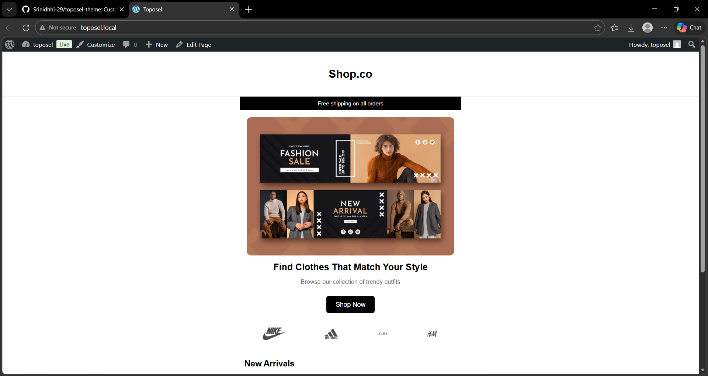
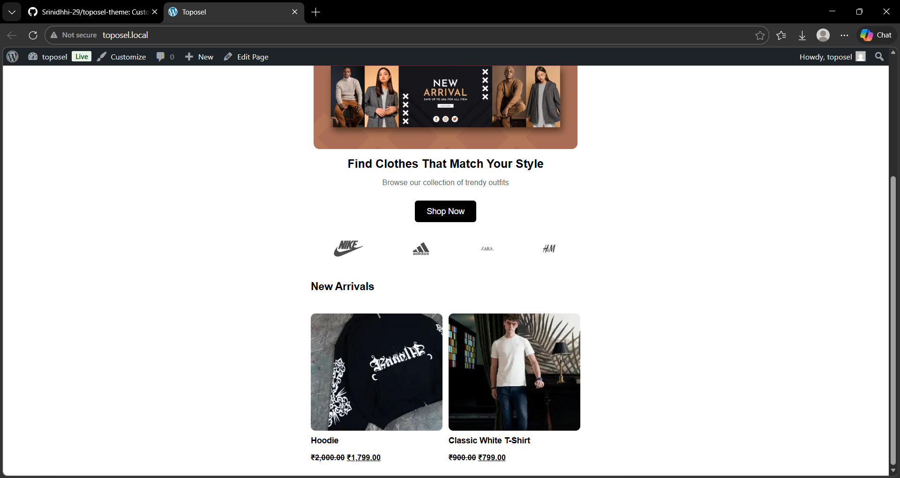
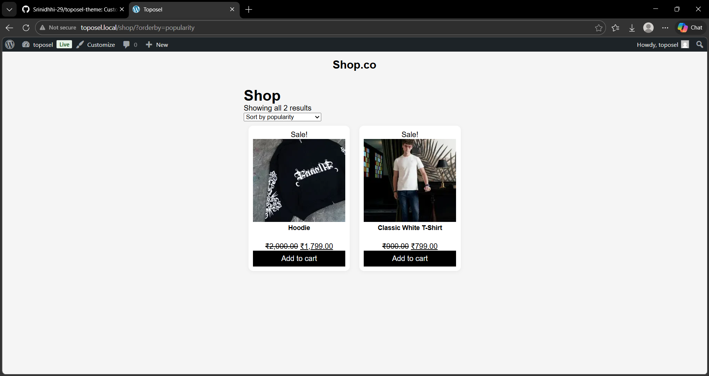

# Toposel WooCommerce Theme
## 📌 Project Overview
This project is a custom WordPress WooCommerce theme developed with a mobile-first approach. It focuses on clean UI, product display, and responsive layout.

## 🔥 Features
- Mobile-first responsive design
- Custom homepage layout
- WooCommerce integration
- Product listing with custom styling
- Clean UI/UX

## 🛠 Technologies Used
- WordPress
- WooCommerce
- HTML
- CSS
- PHP

## 📸 Screenshots
### Homepage

### Shop

## 🚀 How to Run
1. Install WordPress
2. Copy theme into wp-content/themes/
3. Activate theme
4. Install WooCommerce plugin

## 👨‍💻 Author
Srinidhi